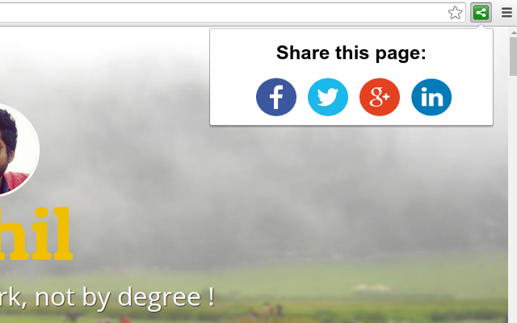

# Social Media Share

:loudspeaker:  Share any website on Facebook, Twitter, LinkedIn and Google Plus with just one click!

> A pretty basic chrome extension which does a little, but does that extremely well.

Suppose you're reading blog post and you really like it and want to share it on your social profile. Either you will copy the link to that post and then share it, or you will search for social media share icons on the blog to share the post.

> How about doing all this with just 1 click?

### Installation

Or manually:

1. Download or `git clone http://github.com/sahildua2305/social-media-share.git`
2. Open Chrome extensions and click on the `Load unpacked extension` button
3. Select the downloaded directory

### Demo

